<div align="center">

# `gabriel@cattuzo:~$ whoami`

### Gabriel Cattuzo

**Computer Engineering Student · Software & Systems Developer**

`C` · `C++` · `Java` · `Python` · `Assembly` · `Computer Systems`

<br>

<a href="https://cattuzo.com">
  
</a>
<a href="https://br.linkedin.com/in/gabrielcattuzo">
  
</a>
<a href="mailto:gabriel@cattuzo.com">
  
</a>

</div>

---

```text
> SYSTEM PROFILE

  Name       : Gabriel Cattuzo
  Education  : Computer Engineering @ PUC-Campinas
  Location   : Brazil

  Focus      : Software Development
               Computer Systems
               Low-Level Programming
               Networks & Computer Architecture

  Languages  : Portuguese [Native]
               English
```

## `$ cat about-me.txt`

I'm a **Computer Engineering student at PUC-Campinas** interested in building software and understanding what happens underneath it.

My projects range from **web applications and high-level programming** to **operating systems, networks, computer architecture and Assembly**.

I particularly enjoy projects where algorithms and software meet the underlying system — working with concepts such as **memory, processors, registers, communication protocols, data structures and state-space exploration**.

Currently exploring **C++, Artificial Intelligence and algorithmic problem solving** through personal and academic projects.

---

## `$ ls ./featured-projects`

### 🧊 Rubik's Cube AI Solver

> `C++` `Algorithms` `Search` `Artificial Intelligence`

Rubik's Cube solver focused on computational cube representation, movement simulation and algorithmic solving techniques.

The project explores **state-space search, data structures and optimization** applied to the enormous number of possible Rubik's Cube configurations.

---

### 🖥️ [Computer Systems Architecture](https://github.com/gabrielcattuzo/Arquitetura-de-Sistemas-Operacionais)

> `C` `MIPS Assembly` `Computer Architecture`

Implementations exploring the relationship between **software and processor architecture**.

Includes translation of C programs into MIPS Assembly and exercises involving **registers, memory, instructions, loops, conditions and arithmetic operations**.

---

### 🤖 [Intelligent Systems & Machine Learning](https://github.com/gabrielcattuzo/PI-Sistemas-Inteligentes-e-Machine-Learning)

> `C` `AI` `BFS` `DFS` `Data Structures`

Implementations of artificial intelligence and search concepts, including **Breadth-First Search, Depth-First Search, trees, queues and state-space exploration**.

---

### 🚢 [Battleship — x86 Assembly](https://github.com/gabrielcattuzo/batalha-naval-assembly)

> `x86 Assembly` `Low-Level Programming`

Implementation of the classic **Battleship game in x86 Assembly**.

Built to explore programming closer to the hardware while implementing game logic, control flow and memory manipulation.

---

### 🔐 [Interactive Safe](https://github.com/gabrielcattuzo/cofre)

> `C` `State Machines` `Hardware / Software`

Interactive safe simulation featuring **password validation, multiple operating states and simulated communication between system components**.

---

### 🌱 [Semente Digital](https://github.com/gabrielcattuzo/semente.digital)

> `HTML` `CSS` `JavaScript` `Green IT`

Web project focused on **technology and sustainability**, covering energy consumption, electronic waste, carbon footprint and smart cities.

---

## `$ ./show-tech-stack`

<div align="center">

### Core Languages


<br><br>


### Web


### Development & Systems


<br><br>


</div>

---

## `$ github --stats`

<div align="center">


<br><br>


</div>

---

## `$ git log --graph --all`

<div align="center">



</div>

---

## `$ ./contribution-snake`

<div align="center">


</div>

---

<div align="center">

## `$ ./connect --gabriel`

**Interested in software, systems, computer engineering or technology?**

<a href="https://cattuzo.com">
  
</a>
<a href="https://br.linkedin.com/in/gabrielcattuzo">
  
</a>
<a href="mailto:gabriel@cattuzo.com">
  
</a>
<a href="https://www.instagram.com/gabriel_cattuzo">
  
</a>

<br><br>

```text
gabriel@cattuzo:~$ _
```

</div>
